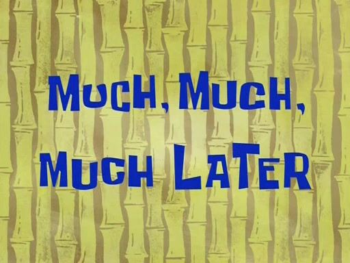

   <h1>Hi, I'm Jason</h1>

    

   <h2>Stuff About Me</h2>

   <h3>I have imposter syndrome!</h3>
   
       ⬛⬛⬛⬛⬛⬛⬛⬛⬛⬛⬛⬛⬛⬛⬛⬛⬛⬛
       ⬛🟥🟥🟥🟥⬛⬛🟥⬛⬛🟥⬛⬛🟥🟥🟥🟥⬛
       ⬛🟥⬛⬛⬛⬛⬛🟥⬛⬛🟥⬛⬛🟥⬛⬛⬛⬛
       ⬛🟥🟥🟥🟥⬛⬛🟥⬛⬛🟥⬛⬛🟥🟥🟥🟥⬛
       ⬛⬛⬛⬛🟥⬛⬛🟥⬛⬛🟥⬛⬛⬛⬛⬛🟥⬛
       ⬛⬛⬛⬛🟥⬛⬛🟥⬛⬛🟥⬛⬛⬛⬛⬛🟥⬛
       ⬛🟥🟥🟥🟥⬛⬛🟥🟥🟥🟥⬛⬛🟥🟥🟥🟥⬛
       ⬛⬛⬛⬛⬛⬛⬛⬛⬛⬛⬛⬛⬛⬛⬛⬛⬛⬛

   <h3>I started coding in the late 90s when I customized my AOL 3.0 profile. Afterwards, I took a break.</h3>
    &nbsp
   
   <h3>During the summer of 2019 I started learning Python :snake: and before 2020 I landed a 6 month contract working mostly with TypeScript/Angular. I barely knew    JavaScript, which I explained in the interview, but here I am almost two years later and they're still paying me.</h3>
   

